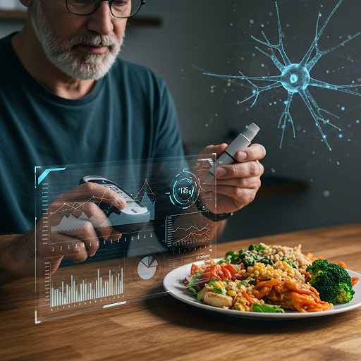
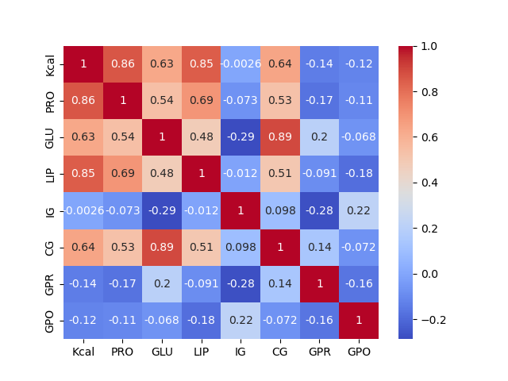

# Mastering Diabetes: How Can AI Contribute to Improving Glycemic Control?
  
---Image Credit: Google AI---

## 🔎 Motivations
To analyze the impact of meal composition and balance on blood glucose levels, I plan to leverage advances in Artificial Intelligence.
The goal is to train a neural network learning model to account for the nature of the data, which is poorly correlated with each other, and especially the complexity of the task. All consulted experts in the field agree. The aim here is to build a model capable of predicting postprandial glycemia based on the nutritional values of meals.

## 1. First Challenge: Collecting Accurate and Sufficient Data
To achieve this, I first needed to collect measurements—a lot of measurements! So, I decided to conduct a systematic measurement campaign covering the nutritional values of all my meals (four meals a day: breakfast, lunch, snack, and dinner), as well as pre- and postprandial blood glucose levels (eight tests per day). The most challenging task was determining the quantities of food in the meals and identifying their nutritional contributions (carbohydrates, proteins, fats, fiber, energy (kcal), glycemic index, and glycemic load). Although these pieces of information are documented, the sources are often incomplete and significantly divergent. The first challenge is therefore to collect the most reliable and accurate data possible.
This campaign was conducted over a two-week period.

## 📝 Collected Data:
- Nutrients: Carbohydrates, Fats, Proteins, Fiber
- Glycemic Index & Glycemic Load
- Energy: kcal
- Pre- and Postprandial Blood Glucose

✅ First significant findings on blood glucose trajectories
Very quickly, one integrates and memorizes the quantities of food in meals and their nutritional contributions. This knowledge leads to composing balanced meals. This balance is a highly influential variable in limiting blood sugar spikes. My postprandial blood glucose levels dropped by about 30% within a week. In fact, it appears that to take effective action, you just need to take measurements. In short, **To take measures, take measurements!**

## 🛠 Data Preparation
```python
# Import necessary libraries
import os, sys
import pandas as pd
import numpy as np
import joblib
import pickle
from sklearn.model_selection import train_test_split
from sklearn.preprocessing import StandardScaler
from sklearn.linear_model import LinearRegression
from sklearn.ensemble import RandomForestRegressor
from xgboost import XGBRegressor
import torch
import torch.nn as nn
import torch.optim as optim
import lightgbm as lgb
from sklearn.metrics import mean_squared_error, r2_score
import matplotlib
import matplotlib.pyplot as plt
import seaborn as sns
```
### 🛠 Loading and Cleaning Data
```python
# Load data
data = pd.read_csv("File.csv", sep=None, engine="python", decimal=",") #Your File.csv

# Cleaning
def clean_data(data):
    for col in data.columns:
        if data[col].dtype == "object":
            data[col] = data[col].str.strip().str.replace(',', '.').astype(float)
    return data

data = clean_data(data)
```
### 📊 Visualizing Feature Correlations
```python
import seaborn as sns
import matplotlib.pyplot as plt

corr_matrix = data.corr()
sns.heatmap(corr_matrix, annot=True, cmap="coolwarm")
plt.show()
```
  
---Feature Correlation---

We observe a weak correlation between the data.

### 🎯 Variable Selection and Normalization
```python
X = data[['Kcal', 'PRO', 'GLU', 'LIP', 'IG', 'CG', 'GPR']]
y = data['GPO']

scaler = StandardScaler()
X_scaled = scaler.fit_transform(X)
```

## 2. 🎉 Training Model Experiments
📊 Linear Regression (Baseline)
```python
model_gl = LinearRegression()
model_gl.fit(X_scaled, y)
y_pred = model_gl.predict(X_scaled)

print("MSE:", mean_squared_error(y, y_pred))
print("R2:", r2_score(y, y_pred))
```
⚠️ Issue: R² Score = -1.7 is a very poor score!
A good model should have an R² close to 1 (1 means perfect prediction). A negative R² means the model is worse than simply averaging observed values. Given the weak correlation in the data, this result is not surprising.

💡XGBoost
```python
model_xgb = XGBRegressor(n_estimators=100, learning_rate=0.1, max_depth=5, random_state=42)
model_xgb.fit(X_scaled, y)
y_pred_xgb = model_xgb.predict(X_scaled)
```
❌ **Disappointing result** (Negative R²), so also not suitable for our problem.

🌟 Random Forest
```python
model_rf = RandomForestRegressor(n_estimators=100, random_state=42)
model_rf.fit(X_scaled, y)
y_pred_rf = model_rf.predict(X_scaled)
```
⚠️ Improvement: R² increases to 0.36.
Statistical models proved inadequate for this problem, so we turned to neural networks.

## 3.🔍 Training a Neural Network with PyTorch
```python
class NeuralNetwork(nn.Module):
    def __init__(self):
        super(NeuralNetwork, self).__init__()
        self.fc1 = nn.Linear(X_scaled.shape[1], 64)
        self.fc2 = nn.Linear(64, 32)
        self.fc3 = nn.Linear(32, 1)

    def forward(self, x):
        x = torch.relu(self.fc1(x))
        x = torch.relu(self.fc2(x))
        return self.fc3(x)
```
✅ The neural network provided the best results!
As hyperparameters, those that lead to the best loss profile are in our case: num_epochs = 500 and learning-rate = 0.001. The loss profile suggests that the model is learning well.

🔍 The first results obtained show a slight prevalence of proteins over the other factors on postprandial blood glucose (GPO). They also seem to suggest that blood glucose control relies on a balance between proteins and carbohydrates. The objective of the next steps of this project is to confirm this result and to quantify it.

## 4. 🛠 Creating the Streamlit Application
A Streamlit application was developed to input and submit parameters GLU, PRO, LIP, IG, CG, GPR in order to predict GPO, postprandial blood glucose.
```python
st.title("Postprandial Blood Glucose Prediction")
if st.button("Predict"):
    input_data = torch.tensor([[GLU, PRO, LIP, IG, CG, GPR]], dtype=torch.float32)
    prediction = model_nn(input_data).item()
    st.success(f"Predicted postprandial blood glucose: {prediction:.2f} mg/dL")
```
✅ Predictions align with actual post-meal blood glucose measurements.

## 🛠 Next Steps TL;DR
As the experiment is conducted from the data of a single person, who eats a balanced diets, without excess and at fixed times, who also engages in regular sports activity, therefore subject to moderate glycemic wanderings, the GPO data do not vary enormously between meals. The model tends to predict values that are close to the training data. It would therefore be necessary to test with other profiles of people to determine the generalization capacity of the model. This is the objective of the later phases of this project.

- Improve the training of the foundational model with more data! 🚀
We are currently testing transformer models, and even diffusion models, where the first convolutional layers will be used to represent the data according to essential characteristics. From this representation in the latent space, we will group them into clusters corresponding to classes of postprandial glycemia values. For this, we need a lot of data.
- Diversify subjects, increase the number of measurements, enrich features (meal timing, physical activity), and improve data quality.
- The foundational model will be generic and should be adapted to the context of each user at the time of inference by providing a few examples of user-specific data or specific prompts.
- The Streamlit application will also be adapted to this new context.

## 🔎 Conclusion
✅ Neural networks are well-suited for this field, outperforming other tested models.
✅ Encouraging results suggest AI can bring major advancements in glycemic control strategies beyond restrictive diets.
✅ Expanding and diversifying data is crucial to improving model generalization.

To go further on this subject,we are calling for a motivated community to contribute to a public and anonymous dataset!

You can read this in Medium (https://medium.com/@saddek.belaid/ai-powered-glycemic-control-a-data-driven-approach-32397f0c464f)
